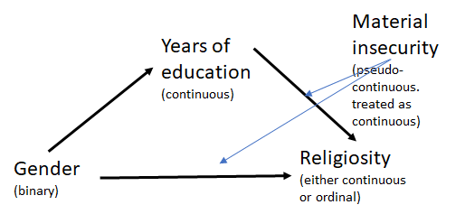

The purpose of this document is to conduct multilevel mediation models using [brms](https://github.com/paul-buerkner/brms).

# 0. Setup

```{r echo=FALSE, cache=FALSE, include=FALSE}
options(width = 120)

library(tidyverse)
library(brms)
library(readxl)
library(sjstats)
library(kableExtra)
library(diagram)
```

Load the data.

```{r warning=F, message=F}
d <- 
  readxl::read_xlsx("data/religionGender.xlsx", na = "NA") %>%
  select(CID, SITE, SEX, BGINT, PRAY, BGRIT, FORMALED, MMAT) %>%
  # create dummy for SEX
  mutate(female = ifelse(SEX=="Women",1,0)) %>%
  # remove extremes for beta distribution
  mutate(BGINT = ifelse(BGINT == 0, 0.0001, ifelse(BGINT == 1, 0.9999, BGINT))) %>%
  # PRAY and BGRIT are ordered factors
  mutate(PRAY  = factor(PRAY,   ordered = TRUE),
         BGRIT = factor(BGRIT,  ordered = TRUE)) %>%
  # standardise continuous variables
  mutate(FORMALED.std = scale(FORMALED)[,],
         MMAT.std     = scale(MMAT)[,])

d
```

Tom would like to fit models of the following type to these data.



We conduct models in three stages: (1) direct effect only, (2) mediation, and (3) moderated mediation. We can later compare these using WAIC. We repeat this process for each religion variable.

# 1. BGINT

Retain complete cases.

```{r}
# n = 1864
d_temp <-
  d %>%
  select(SITE, BGINT, FORMALED.std, female, MMAT.std, SEX) %>%
  drop_na()
```

The religious variable `BGINT` is constrained between 0 and 1, so should not be treated as continuous. A Beta distribution should be used instead of a Gaussian (and WAIC shows the Beta distribution is superior with this outcome variable, I'll leave that up to the reader).

```{r echo=F}
ggplot(d_temp, aes(x = BGINT)) +
  geom_histogram() +
  facet_wrap(.~SEX) +
  theme_classic()
```

## 1.1. Direct effect only

```{r eval=F, echo=F}
# also include FORMALED.std here so we can compare models later
m1.1 <- brm(bf(BGINT ~ 1 + female + (1 | SITE), family = "beta") +
            bf(FORMALED.std ~ 1 + (1 | SITE)) + set_rescor(FALSE),
            d_temp, cores = 4)

m1.1 <- add_ic(m1.1, ic = c("waic", "loo"))

save(m1.1, file = "models/m1.1.rda")
```

```{r echo=F}
load("models/m1.1.rda")
summary(m1.1)
```

This model fits better than the Gaussian alternative.

```{r echo=F, message=F}
pp_check(m1.1, resp = "BGINT")
```

However, the parameter for `female` does not reliably lie above zero.

```{r echo=F}
post <- posterior_samples(m1.1)

tibble(samples = post$b_BGINT_female) %>%
  ggplot(aes(samples)) +
  geom_density() +
  geom_vline(xintercept = 0, linetype = "dashed") +
  theme_classic() +
  xlab("female")
```

In line with this, model comparison (against a null random-intercept-only model) shows that including SEX improves the fit of the model, but not by much. Together, this suggests only a small direct effect of SEX for this outcome variable.

```{r eval=F, echo=F}
m1.1_null <- brm(bf(BGINT ~ 1 + (1 | SITE), family = "beta") +
                 bf(FORMALED.std ~ 1 + (1 | SITE)) + set_rescor(FALSE), 
                 d_temp, cores = 4)

m1.1_null <- add_ic(m1.1_null, ic = c("waic", "loo"))

save(m1.1_null, file = "models/m1.1_null.rda")
```

```{r echo=F}
load("models/m1.1_null.rda")
compare_ic(m1.1, m1.1_null, ic = "waic")
```

## 1.2. Mediation model

```{r eval=F, echo=F}
m1.2 <- brm(bf(BGINT ~ 0 + intercept + female + FORMALED.std + (1 | SITE), family = "beta") +
            bf(FORMALED.std ~ 0 + intercept + female + (1 | SITE)) + set_rescor(FALSE),
            d_temp, cores = 4)

m1.2 <- add_ic(m1.2, ic = c("waic", "loo"))

save(m1.2, file = "models/m1.2.rda")
```

```{r echo=F}
load("models/m1.2.rda")
summary(m1.2)
```

We can draw this out for ease of interpretation. Stars represent 95% CIs outside zero.

```{r echo=F}
data <- c(0, "'-.12*'", 0,
          0, 0, 0, 
          "'-.07'", "'.09'", 0)
M <- matrix (nrow=3, ncol=3, byrow = TRUE, data=data)
plot <- plotmat(M, pos=c(1,2), 
                name= c( "Years of formal\neducation","Female","Religiosity (BGINT)"), 
                box.type = "rect", box.size = 0.12, box.prop=0.5,  curve=0)
rm(M); rm(plot); rm(data)
```

The direct effect decreases very slightly. There's also a possible mediation pathway whereby females have fewer years of formal education, and those with fewer years of formal education are more likely to be religious (the two non-starred paths are very close to being 'significant', see model output).

Model comparison suggests that this mediation model is a better fit to the data than the direct effect alone, but the standard errors are uncertain.

```{r echo=F, warnings=F}
compare_ic(m1.1, m1.2, ic = "waic")
```

## 1.3. Moderated mediation model

Here, we treat the moderator `MAT.std` as a standardised continuous variable. However, from a histogram of the data, it seems to be an ordered categorical predictor (Tom did mention it was "pseudo-continuous"). Perhaps in the future we could use the `mo()` function to model monotonic effects.

```{r eval=F, echo=F}
m1.3 <- brm(bf(BGINT ~ 0 + intercept + FORMALED.std*MMAT.std + female*MMAT.std + (1 | SITE), family = "beta") +
            bf(FORMALED.std ~ 0 + intercept + female + (1 | SITE)) + set_rescor(FALSE), d_temp, cores = 4)

m1.3 <- add_ic(m1.3, ic = c("waic", "loo"))

save(m1.3, file = "models/m1.3.rda")
```

```{r echo=F}
load("models/m1.3.rda")
summary(m1.3)
```

The lack of interaction effect with `MMAT.std` implies that material insecurity does not moderate this mediation. Does model comparison confirm this suspicion?

```{r}
compare_ic(m1.1, m1.2, m1.3, ic = "waic")
```

The model without the moderated mediation performs better.

# 2. PRAY

Retain complete cases.

```{r}
# n = 1155
d_temp <-
  d %>%
  select(SITE, PRAY, FORMALED.std, female, MMAT.std) %>%
  drop_na()
```

## 2.1. Direct effect only

The approach is the same with an ordinal outcome, except we change the model family from beta to cumulative.

```{r eval=F, echo=F}
m2.1 <- brm(bf(PRAY ~ 1 + female + (1 | SITE), family = cumulative("logit")) +
            bf(FORMALED.std ~ 1 + (1 | SITE)) + set_rescor(FALSE),
            d_temp, cores = 4, control = list(adapt_delta = 0.9))

m2.1 <- add_ic(m2.1, ic = c("waic", "loo"))

save(m2.1, file = "models/m2.1.rda")
```

```{r echo=F}
load("models/m2.1.rda")
summary(m2.1)
```

```{r echo=F, message=F}
pp_check(m2.1, resp = "PRAY")
```

For this outcome variable, the parameter for `female` lies reliably above zero.

```{r echo=F}
post <- posterior_samples(m2.1)

tibble(samples = post$b_PRAY_female) %>%
  ggplot(aes(samples)) +
  geom_density() +
  geom_vline(xintercept = 0, linetype = "dashed") +
  theme_classic() +
  xlab("female")
```

In line with this, model comparison (against a null random-intercept-only model) shows that including SEX improves the fit of the model (though there are wide standard errors).

```{r eval=F, echo=F}
m2.1_null <- brm(bf(PRAY ~ 1 + (1 | SITE), family = cumulative("logit")) +
                 bf(FORMALED.std ~ 1 + (1 | SITE)) + set_rescor(FALSE), 
                 d_temp, cores = 4, control = list(adapt_delta = 0.99, max_treedepth = 15))

m2.1_null <- add_ic(m2.1_null, ic = c("waic", "loo"))

save(m2.1_null, file = "models/m2.1_null.rda")
```

```{r echo=F}
load("models/m2.1_null.rda")
compare_ic(m2.1, m2.1_null, ic = "waic")
```

## 2.2. Mediation model

```{r eval=F, echo=F}
m2.2 <- brm(bf(PRAY ~ 1 + female + FORMALED.std + (1 | SITE), family = cumulative("logit")) +
            bf(FORMALED.std ~ 1 + female + (1 | SITE)) + set_rescor(FALSE),
            d_temp, cores = 4, control = list(adapt_delta = 0.99, max_treedepth = 15))

m2.2 <- add_ic(m2.2, ic = c("waic", "loo"))

save(m2.2, file = "models/m2.2.rda")
```

```{r echo=F}
load("models/m2.2.rda")
summary(m2.2)
```

We can draw this out. Stars represent 95% CIs outside zero.

```{r echo=F}
data <- c(0, "'-.18*'", 0,
          0, 0, 0, 
          "'-.25*'", "'.37*'", 0)
M <- matrix (nrow=3, ncol=3, byrow = TRUE, data=data)
plot <- plotmat(M, pos=c(1,2), 
                name= c( "Years of formal\neducation","Female","Religiosity (PRAY)"), 
                box.type = "rect", box.size = 0.12, box.prop=0.5,  curve=0)
rm(M); rm(plot); rm(data)
```

The direct effect has decreased slightly, and there is a 'significant' indirect effect. This is a partial mediation. Does model comparison capture this?

```{r echo=F, warnings=F}
compare_ic(m2.1, m2.2, ic = "waic")
```

Yes. The mediation model is preferred.

## 2.3. Moderated mediation model

```{r eval=F, echo=F}
m2.3 <- brm(bf(PRAY ~ 1 + FORMALED.std*MMAT.std + female*MMAT.std + (1 | SITE), family = cumulative("logit")) +
            bf(FORMALED.std ~ 1 + female + (1 | SITE)) + set_rescor(FALSE), d_temp, cores = 4)

m2.3 <- add_ic(m2.3, ic = c("waic", "loo"))

save(m2.3, file = "models/m2.3.rda")
```

```{r echo=F}
load("models/m2.3.rda")
summary(m2.3)
```

Again the lack of interaction effects suggests that there's no moderation of material insecurity.

```{r}
compare_ic(m2.1, m2.2, m2.3, ic = "waic")
```

`m2.3` is slightly worse than the mediation-only model.

# 3. BGRIT

Retain complete cases.

```{r}
# n = 1171
d_temp <-
  d %>%
  select(SITE, BGRIT, FORMALED.std, female, MMAT.std) %>%
  drop_na()
```

## 3.1. Direct effect only

```{r eval=F, echo=F}
m3.1 <- brm(bf(BGRIT ~ 1 + female + (1 | SITE), family = cumulative("logit")) +
            bf(FORMALED.std ~ 1 + (1 | SITE)) + set_rescor(FALSE),
            d_temp, cores = 4, control = list(adapt_delta = 0.9))

m3.1 <- add_ic(m3.1, ic = c("waic", "loo"))

save(m3.1, file = "models/m3.1.rda")
```

```{r echo=F}
load("models/m3.1.rda")
summary(m3.1)
```

```{r echo=F, warning=F}
pp_check(m3.1, resp = "BGRIT")
```

As before, the parameter for `female` lies reliably above zero.

```{r echo=F}
post <- posterior_samples(m3.1)

tibble(samples = post$b_BGRIT_female) %>%
  ggplot(aes(samples)) +
  geom_density() +
  geom_vline(xintercept = 0, linetype = "dashed") +
  theme_classic() +
  xlab("female")
```

Model comparison (against a null random-intercept-only model) shows that including SEX improves the fit of the model (but again with wide standard errors).

```{r eval=F, echo=F}
m3.1_null <- brm(bf(BGRIT ~ 1 + (1 | SITE), family = cumulative("logit")) +
                 bf(FORMALED.std ~ 1 + (1 | SITE)) + set_rescor(FALSE), 
                 d_temp, cores = 4, control = list(adapt_delta = 0.99, max_treedepth = 15))

m3.1_null <- add_ic(m3.1_null, ic = c("waic", "loo"))

save(m3.1_null, file = "models/m3.1_null.rda")
```

```{r echo=F}
load("models/m3.1_null.rda")
compare_ic(m3.1, m3.1_null, ic = "waic")
```

## 3.2. Mediation model

```{r eval=F, echo=F}
m3.2 <- brm(bf(BGRIT ~ 1 + female + FORMALED.std + (1 | SITE), family = cumulative("logit")) +
            bf(FORMALED.std ~ 1 + female + (1 | SITE)) + set_rescor(FALSE),
            d_temp, cores = 4, control = list(adapt_delta = 0.99, max_treedepth = 15))

m3.2 <- add_ic(m3.2, ic = c("waic", "loo"))

save(m3.2, file = "models/m3.2.rda")
```

```{r echo=F}
load("models/m3.2.rda")
summary(m3.2)
```

In the diagram, stars represent 95% CIs outside zero.

```{r echo=F}
data <- c(0, "'-.19*'", 0,
          0, 0, 0, 
          "'-.19*'", "'.29*'", 0)
M <- matrix (nrow=3, ncol=3, byrow = TRUE, data=data)
plot <- plotmat(M, pos=c(1,2), 
                name= c( "Years of formal\neducation","Female","Religiosity (BGRIT)"), 
                box.type = "rect", box.size = 0.12, box.prop=0.5,  curve=0)
rm(M); rm(plot); rm(data)
```

Model comparison.

Another partial mediation. Model comparison captures this.

```{r echo=F, warnings=F}
compare_ic(m3.1, m3.2, ic = "waic")
```

## 3.3. Moderated mediation model

```{r eval=F, echo=F}
m3.3 <- brm(bf(BGRIT ~ 1 + FORMALED.std*MMAT.std + female*MMAT.std + (1 | SITE), family = cumulative("logit")) +
            bf(FORMALED.std ~ 1 + female + (1 | SITE)) + set_rescor(FALSE), d_temp, cores = 4)

m3.3 <- add_ic(m3.3, ic = c("waic", "loo"))

save(m3.3, file = "models/m3.3.rda")
```

```{r echo=F}
load("models/m3.3.rda")
summary(m3.3)
```

Material insecurity seems to affect the "b" path (FORMALED.std -> BGRIT). Let's visualise this.

```{r echo=F}
post <- posterior_samples(m3.3)

# calculate change in slope
mmat.seq <- seq(min(d_temp$MMAT.std), max(d_temp$MMAT.std), length.out = 1000)
b_slope  <- b_slope_0.025 <- b_slope_0.975 <- c()
for (i in 1:1000) {
  temp <- post$b_BGRIT_FORMALED.std + post$`b_BGRIT_FORMALED.std:MMAT.std`*mmat.seq[i]
  b_slope       <- c(b_slope, median(temp))
  b_slope_0.025 <- c(b_slope_0.025, quantile(temp, 0.025))
  b_slope_0.975 <- c(b_slope_0.975, quantile(temp, 0.975))
}

tibble(MMAT = mmat.seq, b_slope = b_slope, 
       b_slope_0.025 = b_slope_0.025, b_slope_0.975 = b_slope_0.975) %>%
  ggplot(aes(y = b_slope, ymin = b_slope_0.025, ymax = b_slope_0.975, x = MMAT)) +
  geom_smooth(stat = "identity", fill = "grey70", color = "black", alpha = 1, size = 1/2) +
  geom_hline(yintercept = 0, linetype = "dashed") +
  theme_classic() +
  xlab("Material insecurity (MMAT)") +
  ylab("Path B slope (FORMALED -> BGRIT)")
```

It seems years of formal education has a negative effect on religiosity only for those lower in material insecurity (or lower in material SECURITY? I'm not sure).

This leads to an improvement in model fit, but this isn't substantial. This suggests there's a small moderating effect of material insecurity in this model.

```{r}
compare_ic(m3.1, m3.2, m3.3, ic = "waic")
```

# 4. Plotting all model comparisons

It's useful to visualise all these model comparisons at once. Remember, a lower WAIC is better. Lines represent 95% CIs.

```{r echo=F}
waicFig1a <-
  compare_ic(m1.1_null, m1.1, m1.2, m1.3, ic = "waic")$ic_diffs__ %>%
  as.matrix() %>% as_tibble() %>% slice(1:3) %>%
  mutate(model   = c("Direct effect","Mediation","Moderated mediation"),
         outcome = rep("BGINT",3))

waicFig1b <-
  compare_ic(m2.1_null, m2.1, m2.2, m2.3, ic = "waic")$ic_diffs__ %>%
  as.matrix() %>% as_tibble() %>% slice(1:3) %>%
  mutate(model   = c("Direct effect","Mediation","Moderated mediation"),
         outcome = rep("PRAY",3))

waicFig1c <-
  compare_ic(m3.1_null, m3.1, m3.2, m3.3, ic = "waic")$ic_diffs__ %>%
  as.matrix() %>% as_tibble() %>% slice(1:3) %>%
  mutate(model   = c("Direct effect","Mediation","Moderated mediation"),
         outcome = rep("BGRIT",3))

waicFig1 <- rbind(waicFig1a, waicFig1b, waicFig1c)

fig1 <-
  waicFig1 %>%
  ggplot(aes(x = fct_rev(factor(model, levels = model[1:3])), 
             y = WAIC*-1, 
             ymin = WAIC*-1 - (SE*1.96), 
             ymax = WAIC*-1 + (SE*1.96))) +
  geom_pointrange(size = 0.35) +
  geom_hline(yintercept = 0, linetype = "dashed") +
  coord_flip() +
  xlab(NULL) +
  ylab("WAIC difference from null model") +
  facet_grid(rows = vars(outcome)) +
  theme_classic()

fig1

# save to file
ggsave(fig1, file = "figures/fig1.pdf", height = 6, width = 6)
```

# Session Info

```{r}
sessionInfo()
```